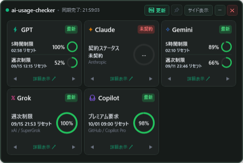
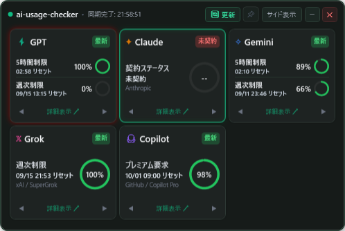
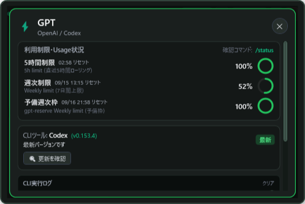
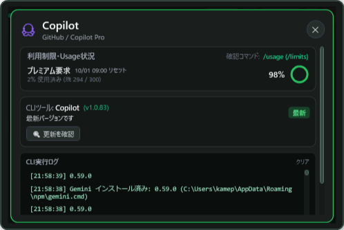

# ai-usage-checker (AI利用状況チェッカー)

[](./LICENSE)
[](https://dotnet.microsoft.com/)
[]()

デスクトップPC上で各種AIサービス（OpenAI Codex, Claude, Gemini, Grok, GitHub Copilot）の**利用制限・クォータ（5時間制限、週次制限、プレミアム要求など）**をリアルタイムに確認・監視できる、軽量で洗練されたWindowsデスクトップ（WPF / .NET 10）アプリケーションです。

サッと起動してデスクトップの隅に常駐でき、各AIのCLIツールや公式エンドポイントから実際の生データを取得してグラフィカルに可視化します。

---

## 📸 アプリケーション画面

### メイン画面（5つの主要AIサービス & 2重制限対応）


- **⚡ GPT (OpenAI / Codex)**: 5時間制限（枯渇・リセット時刻）と週次制限を**上下2段で同時表示**
- **✦ Claude (Anthropic)**: 契約ステータス（未契約・プラン未加入バッジ対応、契約時は5h/週次ダブル表示）
- **✧ Gemini (Google DeepMind)**: 5時間制限と週次制限を**上下2段で同時表示（解除時刻統一）**
- **𝕏 Grok (xAI / SuperGrok)**: SuperGrok 週次制限（100%残量・リセット日時）
- **🐙 Copilot (GitHub / Copilot Pro)**: プレミアム要求（月間300回中の使用量・リセット日時）

---

### 直感的なビジュアル通知（週次制限枯渇 ＆ 100%回復ホタル点滅）
利用状態の変化を、作業の邪魔にならない上品な光彩で直感的に通知します。



- **🟥 週次制限枯渇時のダークレッド枠＋ぼかし光彩**:
  - 週次クォータが0%になった場合、カード枠がダークテーマに馴染む深みのある赤（`#EF4444`）と柔らかなぼかし光彩（DropShadow）で囲まれ、「現在利用不能」であることが一目で伝わります。
- **🟩 0%から100%回復時のグリーンホタル点滅（Breathe Glow）**:
  - 0%だった制限（5時間または週次）が100%に完全回復した際、外枠がエメラルドグリーンの穏やかな呼吸（ホタル点滅）アニメーションで知らせてくれます。
  - **カードをクリックして詳細を開く**か、**利用して100%未満になると自動解除**されます。
- **⏰ 待ち遠しい解除日時の高い視認性**:
  - 「いつ制限が解除されるか」がすぐ分かるよう、カードデザイン全体のバランスを保ちつつ、リセット日時・残り時間のフォント視認性（コントラスト・ウェイト）を強化しています。

---

### 詳細ポップアップ画面 & CLI管理
各カードをクリックまたは「詳細表示 ↗」を押すと、詳細情報・CLI管理・実行ログが表示されます。本体からはみ出さず、洗練されたダークスクロールバーで快適に閲覧できます。

| GPT (Codex) 詳細 | Copilot Pro 詳細 |
|:---:|:---:|
|  |  |

- **利用制限の詳細内訳**: 予備週次枠 (`gpt-reserve`) や、プレミアム要求の使用回数（例: `2% 使用済み (残 294 / 300)`）まで正確に表示
- **CLIツールの状態管理**: インストール状況、最新バージョン、更新通知（ワンクリック更新/インストール対応）
- **リアルタイムCLI実行ログ**: バックグラウンドでのAPI取得・CLI同期のログをターミナル風コンソールで可視化

---

### サイド表示モード（画面端へのドックバー）
作業に集中したいときは、上部の「サイド表示」ボタンを押すことで、画面端の極小バーにスマートに折りたたむことができます。上下ドラッグで好みの高さへ自由に移動でき、クリックするだけで元のサイズに即座に復帰します。


---

## ✨ 主な機能と特徴

1. **5時間制限 ＆ 週次制限のカード上ダブル表示**
   - **GPT (Codex)**、**Gemini**、および**Claude（契約時）**のように、短期（5時間ローリング）と長期（週次）の2つの制限を持つモデルは、**メインカード上で両方の残量・リセット日時・プログレスリングを直接確認**できます。
2. **プランに応じた制限枠の動的自動判定（Plus / Pro等）**
   - **GPT (Codex)**:
     - **Plus契約等**: 5時間制限 ＋ 週次制限 ＋ 予備枠（`gpt-reserve`）の3層クォータを検出し、**カード上でダブル表示**。
     - **Pro契約等**: 短期制限がなく週次制限のみのプランでは、APIの制限ウィンドウ秒数（`limit_window_seconds`）を自動解析し、**自動的に週次制限のみの単一枠（大リング）表示に切り替わります**。
   - **Claude**:
     - **未契約時**: 「未契約」赤バッジおよび「--」ゲージの単一枠として表示。
     - **契約時（Claude Pro / Max / Team等）**: `~/.claude.json` のクォータ（`five_hour` および `seven_day`）を検知し、**自動的に5時間制限＋週次制限のダブル表示へと昇格・機能**します。
   - **Gemini**: 5時間制限 ＋ 週次制限（Google DeepMind Antigravity連携）
   - **Grok**: SuperGrok Weekly limit（週次単一制限）
   - **GitHub Copilot**:
     - **年間契約（維持環境等）**: **「プレミアム要求」**（単位: 要求/回、例: `2% 使用済み (残 294 / 300)`）として正確に表示。
     - **一般・月間契約等**: **「AI Credits」**（単位: Credits、例: `{used}% 使用済み (残 {remaining} / {total} Credits)`）として自動判定・表示。
3. **リセット時間フォーマットの完全統一**
   - 24時間以内の短期制限（5時間枠など）は全て **`HH:mm リセット`**、24時間以上の長期枠は **`MM/dd HH:mm リセット`** で統一され、直感的に把握できます。
4. **実データ・生API連携**
   - モックではなく、ローカルの認証トークン（Codex `auth.json`、Claude `~/.claude.json`）や GitHub CLI（`gh api /copilot_internal/user`）、言語サーバーRPCから実際の生クォータを直接取得します。
5. **カードの自由な並び替え（◀ ▶）**
   - 各カード下の「◀」「▶」ボタンで、よく使うAIサービスをお好みの順序に並び替え可能。設定は次回起動時にも自動保存されます。
6. **最前面固定（ピン留め 📌）**
   - コード編集や作業中も画面最前面に固定して、残りクォータを常に視界に入れておくことができます。
7. **自動更新**
   - バックグラウンドで定期的に（5分間隔）最新のクォータを自動同期します。右上の「更新」ボタンでいつでも手動更新も可能です。

---

## 📊 対応AIサービスと制限体系一覧

| サービス名 | 対象CLI / プロバイダ | 制限体系 | 取得方式 |
|---|---|---|---|
| **GPT** | OpenAI Codex (`codex`) | プラン動的判定<br>・Plus等: 5時間制限 + 週次制限 + 予備枠<br>・Pro等: 週次制限のみ（自動判定） | Codex認証トークン経由 生API直接取得 |
| **Claude** | Anthropic (`claude`) | 契約時: 5時間制限 + 週次制限<br>未契約時: 契約ステータス | `~/.claude.json` / Claude CLI 連携 |
| **Gemini** | Google DeepMind (`gemini`) | 5時間制限 + 週次制限 | Antigravity 言語サーバー連携 |
| **Grok** | xAI (`grok`) | 週次制限 (SuperGrok) | Grok CLI / 利用状況判定 |
| **Copilot** | GitHub Copilot (`copilot`) | 契約形態自動判定<br>・年間契約: プレミアム要求 (要求/回)<br>・一般/月間: AI Credits (Credits) | GitHub CLI (`gh api`) 直接連携 |

---

## 🛠️ 動作環境 & 必要要件

- **OS**: Windows 10 / 11 (64-bit)
- **フレームワーク**: .NET 10.0 (WPF)
- **推奨環境**:
  - GitHub CLI (`gh`)（GitHub Copilotの正確なクォータ取得に使用）
  - 各AI CLIツール（Codex CLI 等がインストールされている場合、自動検出・連携）

---

## 🚀 ビルド & 起動方法

### 1. リポジトリのクローン
```bash
git clone https://github.com/your-username/ai-usage-checker.git
cd ai-usage-checker
```

### 2. ビルド & 実行
```bash
# 通常起動
dotnet run

# リリースビルド
dotnet build -c Release
```

### 3. コマンドライン引数（テスト・スクリーンショット撮影）
ヘッドレス/テスト用途として、起動時に自動でスクリーンショットを保存して終了する引数が用意されています：
- `--render-test`: メイン画面のスクリーンショットを生成
- `--render-docked`: サイド表示モードのスクリーンショットを生成
- `--render-detail-gpt`: GPT詳細ポップアップ画面のスクリーンショットを生成
- `--render-detail-copilot`: Copilot詳細ポップアップ画面のスクリーンショットを生成
- `--render-glow-test`: 状態通知エフェクト（週次枯渇赤グロー ＆ 回復ホタル点滅）のスクリーンショットを生成

---

## ⚙️ 設定ファイルの保存場所

設定情報（カードの並び順、最前面固定、サイド表示の縦位置など）は以下にJSON形式で保存されます：
```
%APPDATA%\AIUsageChecker\settings.json
```

---

## 📄 ライセンス

本プロジェクトは **[MIT License](./LICENSE)** のもとで公開されています。

```text
MIT License

Copyright (c) 2026 safubuki
```

商用利用、改変、再配布、フォークなど、誰でも自由にご利用いただけます。詳細は [LICENSE](./LICENSE) ファイルをご確認ください。

